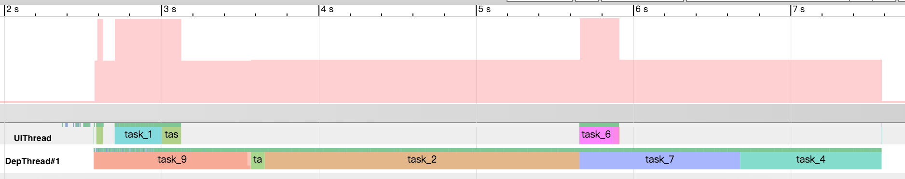

# Dep是什么？

一般情况下，我们的应用启动过程是由多个子任务组成，各子任务之间存在依赖关系，且只有当各个子任务全部执行完成之后，整个应用才算启动完成。
由于各种子任务可能在不同的线程中完成初始化，导致整个初始化过程非常复杂。为了简化管理各子任务间的依赖情况，`Dep`就这样出现了。


# 如何使用？

* 通过`TaskSet.Builder`创建任务结合管理任务之间的依赖关系。
* 通过`TaskManager.getInstance().startTask()`来启动一个任务。
* 通过`TaskExecutionListener`、`TaskSetExecutionListener`监听任务的执行情况。


```java
// 创建一个任务集合
TaskSet.Builder builder = new TaskSet.Builder("TaskSet1");
        builder.add(task1).before(task2).before(task3);
        builder.add(task2).before(task6);
        builder.add(task3).after(task6);
TaskSet taskSet = wrapTaskSetMonitor(builder.build());

TaskSet taskSet2 = new TaskSet.Builder("TaskSet2")
        .add(task4).after(task7)
        .add(task5).before(task7)
        .add(taskSet).before(task4)
        .build()

// 启动任务
TaskManager.getInstance().startTask(taskSet);
```

* 开启debug

```java
com.coofee.dep.Log.setDebug(true)
com.coofee.dep.Log.setLogImpl(log)
```

开启debug之后，可以通过`systrace`工具获取trace，进一步分析和优化任务执行。

# 如何优化任务执行总耗时？

这里我们以`app`项目为例，使用`android sdk`自带的`systrace`工具（其位于`platform-tools/systrace`目录中）执行如下命令
获取trace信息：

```shell
python systrace.py -a com.coofee.dep.demo -o trace.html sched freq
```

然后使用浏览器打开`trace.html`文件，就可以对trace文件进行分析。


## 线程数对总耗时的影响

通过调整`TaskExecutor`的工作线程个数可以很明显的观察到线程数对任务初始化总耗时的影响。从下图可以看出，当工作线程设置为单线程时，总耗时约5秒多，当设置为多线程时，总耗时为约2秒多。由此可见使用多线程可以加快任务的执行，降低任务初始化的总耗时。
那么问题来了，是否开启的线程数越多，任务初始化的就越快，总耗时就越少？

* 单线程(总耗时5s+)



* 多线程(总耗时2s+)


从上面多线程对总耗时影响的trace图可以看出，上面总共使用了5个工作线程，但是由于任务存在依赖顺序，所以并没有将5条工作线程全部跑满，因此，即使我们将工作线程数再增加，也不会降低任务初始化的总耗时，反而可能因为线程数增加，资源消耗过多，导致拖慢任务初始化。
所以只有当设置了合适的线程数时，才能加快任务初始化，降低总耗时。那么如何进一步优化总耗时呢？

## 任务依赖顺序对总耗时的影响

我们继续观察多线程对总耗时影响的trace图，可以发现`TASK_2`任务非常耗时(同时还有部分任务依赖它运行, 如`TASK_6`等),几乎贯穿了整个初始化的过程。当其执行一半之后，整个初始化过程只剩下了`TASK_2`、`TASK_4`和`TASK_6`等任务，此时工作线程
`DepThread 1~3`全部处于空闲状态，而`TASK_6`任务则需要运行在主线程，从而导致UI线程阻塞了将近`1.8`秒的时间。

故而，优化总耗时就可以从以下两个方面入手：

1. 调整`TASK_2`和`TASK_4`任务的依赖顺序，让其能够尽可能早的开始执行，`减少其等待时间`。
2. 将`TASK_2`和`TASK_4`任务拆分为可以并行的小任务，`利用其它空闲的线程，并行执行任务`。

## 总结

综上，我们可以通过如下手段来优化初始化耗时:

1. 对初始化任务设置合适的线程数，让任务能够并行执行。
2. 优化任务间的依赖关系，尽可能减少等待时间。
3. 拆解耗时长的任务为多个子任务，并行加速任务执行。


